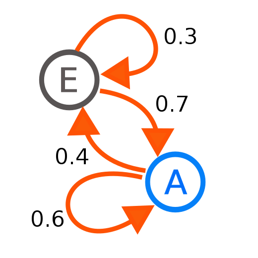
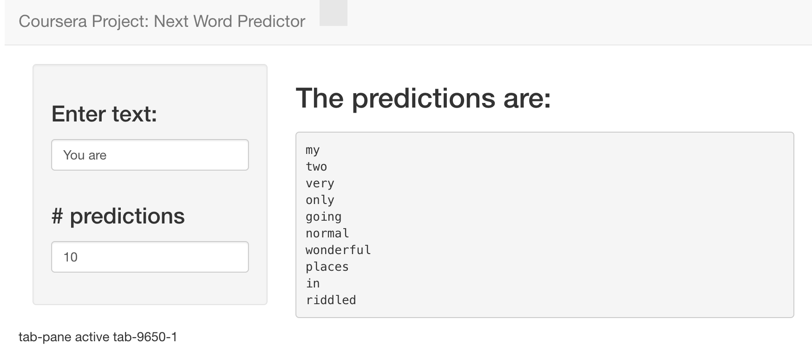

Final Presentation: Next Word Predictor
========================================================
author: annasbest
date: 11th of November 2022
autosize: true
class: smaller

Data Science Specialization Capstone Project 
Johns Hopkins University 

Overview
========================================================

- Markov Chain: The algorithm/model that was used
- About Next Word Predictor
- Interface/App

Markov Chain: The algorithm/model that was used
========================================================

Quote/Figure (from Wikipedia):

"A Markov chain or Markov process is a stochastic model describing a sequence of possible events in which the probability of each event depends only on the state attained in the previous event"

This is a 2-state MC. Numbers represent probability of each event (changing from one state to another state).

About Next Word Predictor
========================================================

We used Natural Language Processing and Markov Chain Theory to predict words.

Built from a sample of 200'000 lines extracted from  blogs, news and twitter data.

Additionally, Tokenization and Cleaning was necessary (bad words, non-ascii, etc.).

We used out developed n-grams alogrithm to split the data.

MC was built using the `markovchain` package

Shiny App to showcase algorithm.

Interface/App
========================================================

Easy to use -> Just enter text in textbox and define the number of predictions (left side)

Predictions will show up on right side!

** Further Investigations needed to improve algorithm **

<small>

